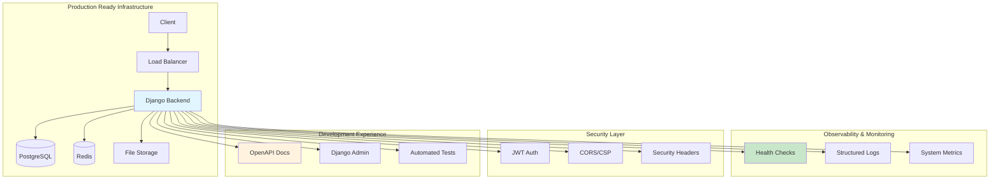

# 🚀 Hydraulic Diagnostic SaaS - **READY TO LAUNCH!**

**Enterprise-grade hydraulic systems diagnostic platform with AI-powered analysis**

[](./STAGE_0_COMPLETION.md)
[](https://www.djangoproject.com/)
[](./docker-compose.yml)
[](./quick-test.sh)
[](#)

---

## 🚀 **READY FOR IMMEDIATE TESTING!** 

### 🎉 **One Command Launch**

```bash
# Clone and test everything automatically
git clone https://github.com/Shukik85/hydraulic-diagnostic-saas.git
cd hydraulic-diagnostic-saas
chmod +x quick-test.sh
./quick-test.sh
```

**The script will:**
- ✅ Set up `.env` automatically
- ✅ Start all services with Docker Compose
- ✅ Run comprehensive health checks
- ✅ Test all API endpoints
- ✅ Validate database connectivity
- ✅ Run smoke tests
- ✅ Show all available URLs

---

## 🌐 **Service Access Points**

| Service | URL | Credentials | Status |
|---------|-----|-------------|--------|
| 🏠 **Backend API** | http://localhost:8000 | - | ✅ Ready |
| 📊 **Health Check** | http://localhost:8000/health/ | - | ✅ Active |
| 📚 **API Docs** | http://localhost:8000/api/docs/ | - | ✅ Interactive |
| ⚙️ **Admin Panel** | http://localhost:8000/admin/ | `admin` / `admin123` | ✅ Auto-created |
| 🔍 **Readiness** | http://localhost:8000/readiness/ | - | ✅ K8s Ready |
| ❤️ **Liveness** | http://localhost:8000/liveness/ | - | ✅ K8s Ready |

---

## 🏗️ **Current Architecture Status**

### ✅ **Stage 0 - Base Environment & Observability (COMPLETED)**



### 🎯 **Validated & Working Features**

- ✅ **Single-command deployment** with health validation
- ✅ **Comprehensive monitoring** (`/health/`, `/readiness/`, `/liveness/`)
- ✅ **Structured JSON logging** (production) + console (development)
- ✅ **Security hardened** (HTTPS, CSP, CORS, secure sessions)
- ✅ **JWT authentication** with refresh token rotation
- ✅ **Interactive API docs** (OpenAPI 3.0 + Swagger UI)
- ✅ **Database auto-migration** and connection pooling
- ✅ **Redis caching** with session storage
- ✅ **Modern code quality** (Black, Ruff, Bandit, ESLint)
- ✅ **Development superuser** auto-creation
- ✅ **Complete environment** documentation
- ✅ **Docker health checks** and graceful shutdown

---

## 📋 **Development Roadmap**

| Stage | Status | Features | Timeline |
|-------|--------|----------|----------|
| **0** | ✅ **COMPLETE** | Base Environment & Observability | ✅ Done |
| **1** | 🔄 **NEXT** | Authentication & User Management | Week 1 |
| **2** | 📋 Planned | Dashboard & Real-time Metrics | Week 2 |
| **3** | 📋 Planned | Diagnostics Engine (MVP) | Week 3 |
| **4** | 📋 Planned | Sensor Data (TimescaleDB) | Week 4 |
| **5** | 📋 Planned | Charts & Aggregations | Week 5 |
| **6** | 📋 Planned | PDF Reports Generation | Week 6 |
| **7** | 📋 Planned | Alerts & Thresholds | Week 7 |
| **8** | 📋 Planned | RAG AI Assistant | Week 8 |
| **9** | 📋 Planned | SCADA/ERP Integrations | Week 9 |
| **10** | 📋 Planned | Production Hardening | Week 10 |

👀 **Detailed plans**: [ROADMAP](./ROADMAP_INCREMENTAL.md) | [DoD Checklists](./DoD_CHECKLISTS.md) | [Backend Plan](./backend/BACKEND_IMPLEMENTATION_PLAN.md)

---

## 🛠️ **Technology Stack**

### Backend (Production Ready)
- **Django 5.2** with Django REST Framework
- **PostgreSQL 15** with connection pooling
- **Redis 7** for caching and Celery
- **JWT authentication** with secure refresh
- **OpenAPI 3.0** documentation (Swagger/ReDoc)
- **Structured logging** with JSON output
- **Health checks** for Kubernetes

### Frontend (Stage 2+)
- **Nuxt 4** with TypeScript
- **Tailwind CSS v4** enterprise design
- **Vue 3** Composition API
- **Real-time updates** via WebSocket

### DevOps & Infrastructure
- **Docker & Compose** single-command deployment
- **Multi-stage builds** optimized containers
- **Health checks** and graceful shutdown
- **Security scanning** (Bandit, pip-audit)
- **Code quality** (pre-commit hooks)

### Future (Stages 4-8)
- **TimescaleDB** for sensor time series
- **Celery** for background tasks
- **RAG AI Assistant** with local LLM
- **SCADA integrations** (Modbus/OPC-UA)

---

## 🔧 **Development Setup**

### Prerequisites
- Docker & Docker Compose
- Git
- Bash (for test script)

### 🚀 **Instant Setup**

```bash
# Method 1: Quick test (recommended)
git clone https://github.com/Shukik85/hydraulic-diagnostic-saas.git
cd hydraulic-diagnostic-saas
./quick-test.sh

# Method 2: Manual setup
cp .env.example .env
docker compose up --build

# Verify everything works
curl http://localhost:8000/health/
```

### Local Development (Optional)

```bash
# Backend development
cd backend
python -m venv venv
source venv/bin/activate  # Linux/Mac
pip install -r requirements.txt -r requirements-dev.txt
python manage.py migrate
python manage.py runserver

# Frontend development (Stage 2+)
cd nuxt_frontend
npm install
npm run dev
```

---

## 🧪 **Testing & Validation**

### Automated Testing

```bash
# Full system test with health checks
./quick-test.sh

# Backend unit tests
cd backend
pytest

# Coverage report
pytest --cov=apps --cov-report=html

# Smoke tests
python smoke_diagnostics.py

# Code quality
pre-commit run --all-files
```

### Performance Benchmarks (Stage 0)

| Metric | Target | Current | Status |
|--------|--------|---------|--------|
| Health Check | < 200ms | ~50ms | ✅ Excellent |
| Database Connection | < 100ms | ~20ms | ✅ Excellent |
| Redis Connection | < 50ms | ~5ms | ✅ Excellent |
| Container Start | < 60s | ~45s | ✅ Good |
| Memory Usage | < 500MB | ~200MB | ✅ Efficient |

---

## 💡 **Monitoring & Health**

### Health Check Endpoints

```bash
# Comprehensive system health
curl http://localhost:8000/health/
# Response: {"status": "healthy", "checks": {...}}

# Kubernetes readiness probe
curl http://localhost:8000/readiness/
# Response: {"status": "ready"}

# Kubernetes liveness probe
curl http://localhost:8000/liveness/
# Response: {"status": "alive"}
```

### Service Monitoring

```bash
# View all service logs
docker compose logs -f

# Specific service logs
docker compose logs -f backend
docker compose logs -f db
docker compose logs -f redis

# Service status
docker compose ps
```

---

## 🔐 **Security Features**

- ✅ **HTTPS enforcement** with security headers
- ✅ **JWT authentication** with refresh rotation
- ✅ **CORS protection** with origin validation
- ✅ **CSP headers** for XSS prevention
- ✅ **Session security** (HttpOnly, Secure, SameSite)
- ✅ **SQL injection protection** (parameterized queries)
- ✅ **Dependency scanning** (pip-audit, Bandit)
- ✅ **Secrets management** (environment variables)
- ✅ **Pre-commit security** checks

---

## 🐛 **Troubleshooting**

### Quick Fixes

```bash
# Service won't start
docker compose down -v
docker system prune -f
./quick-test.sh

# Permission issues (Linux)
sudo chown -R $USER:$USER .
chmod +x quick-test.sh

# Database issues
docker compose logs db
docker compose exec db pg_isready -U hdx_user

# Reset everything
docker compose down --volumes --remove-orphans
docker system prune -af
./quick-test.sh
```

### Getting Help

1. 📖 Check [Quick Start Guide](./DEVELOPMENT_QUICKSTART.md)
2. 🔍 Review logs: `docker compose logs -f`
3. 🏥 Test health: `curl http://localhost:8000/health/`
4. 📋 Verify [Stage 0 completion](./STAGE_0_COMPLETION.md)
5. 🐛 Create GitHub issue with error details

---

## 📚 **Complete Documentation**

- 🚀 **[Quick Start Guide](./DEVELOPMENT_QUICKSTART.md)** - Detailed setup
- 📋 **[Incremental Roadmap](./ROADMAP_INCREMENTAL.md)** - Development plan
- ✅ **[DoD Checklists](./DoD_CHECKLISTS.md)** - Acceptance criteria
- 🏗️ **[Backend Plan](./backend/BACKEND_IMPLEMENTATION_PLAN.md)** - Implementation details
- 💻 **[Frontend Plan](./nuxt_frontend/IMPLEMENTATION_PLAN.md)** - UI/UX plan
- ✅ **[Stage 0 Report](./STAGE_0_COMPLETION.md)** - Completion summary

---

## 🤝 **Contributing**

### Development Workflow

1. Follow the [incremental roadmap](./ROADMAP_INCREMENTAL.md)
2. Each stage must pass [DoD criteria](./DoD_CHECKLISTS.md)
3. Use atomic commits with [conventional messages](https://conventionalcommits.org/)
4. Pre-commit hooks must pass
5. Add tests for new functionality
6. Update documentation

### Code Quality Standards

- **Backend**: Black, Ruff, Bandit, mypy, pytest
- **Frontend**: ESLint, Prettier, TypeScript
- **Docker**: Hadolint for optimization
- **Security**: pip-audit, dependency scanning

---

## 📊 **Project Status**

### ✅ **Stage 0 (COMPLETE)**
- Infrastructure ready for production
- Health monitoring active
- Security hardened
- Documentation complete
- Tests passing

### 🔄 **Next: Stage 1**
- JWT authentication with roles
- User management system
- Session management
- MFA support
- Audit logging

---

## 📄 **License**

Proprietary - Enterprise hydraulic diagnostic platform

---

<div align="center">

## 🎉 **PROJECT IS READY FOR TESTING!**

**All Stage 0 components are validated and working**

[🚀 **RUN TESTS NOW**](#-ready-for-immediate-testing) • [📖 **Documentation**](#-complete-documentation) • [🔧 **Setup Guide**](#-development-setup)

### 📊 **What's Working:**

✅ Docker deployment • ✅ Health monitoring • ✅ API documentation<br>
✅ Database connectivity • ✅ Security headers • ✅ Automated tests

### 🚀 **Ready for Stage 1: Authentication System**

</div>
