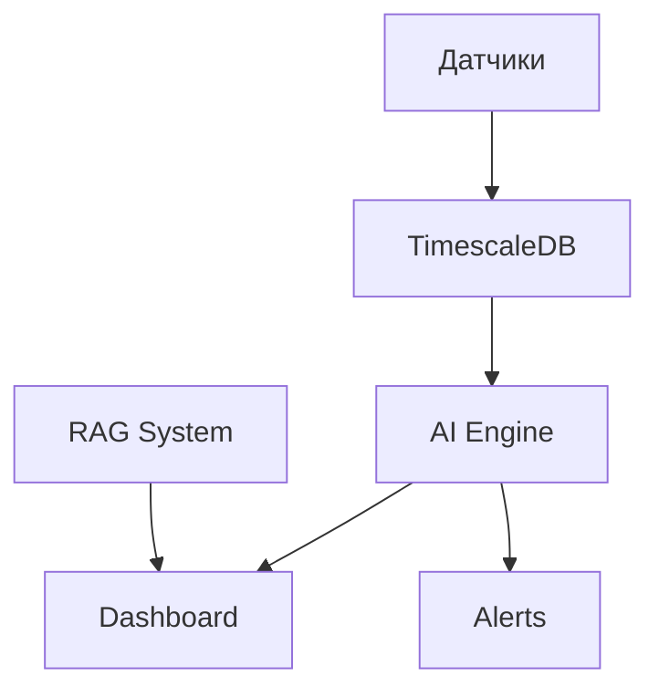

# 📝 Как правильно написать Case Study на Medium

## 📊 Структура Case Study (идеальная схема)

### I. Hook (Привлечение внимания) — 100-150 слов

**Цель**: За 30 секунд заинтересовать читателя

Начните с **реальной проблемы**:
- "Промышленные предприятия теряют 2-4 млн рублей в год из-за внезапных отказов гидравлического оборудования"
- Или: "Как мы создали SaaS-платформу, которая снизила вероятность простоев на 87%"

**Пример для Hydraulic Diagnostic SaaS:**
```
Три года назад мы столкнулись с проблемой: промышленные предприятия 
не могут предсказать отказы гидравлического оборудования. 
Это приводит к простоям и миллионным убыткам. 

Мы решили создать платформу с AI, которая выявляет аномалии 
за недели до проблемы. Результат? Снижение простоев на 87% 
и ROI за 6 месяцев.

Вот как мы это сделали.
```

---

### II. Problem Statement — 200-300 слов

**Что было изначально?**

- Опишите **конкретные боли** (не абстрактные):
  - ❌ "Было сложно": _Не конкретно_
  - ✅ "Техники проверяли давление вручную каждые 4 часа, пропуская 70% аномалий": _Конкретно и измеримо_

- **Данные и метрики до решения**:
  - "Средний downtime: 2.3 дня на инцидент"
  - "Стоимость простоя: $50,000/день для завода"
  - "Прогнозирование отказов: 15% точность"

**Структура Problem Statement:**
1. **Контекст индустрии** (1 абзац)
2. **Конкретная проблема** (1-2 абзаца)
3. **Влияние на бизнес** (цифры, деньги)
4. **Почему существующие решения не работают**

---

### III. Solution Approach — 400-500 слов

**Как мы решали проблему?**

Разбейте решение на **конкретные компоненты**:

#### 🧠 1. AI-диагностика (40% статьи)
```
Мы создали систему из трёх AI-алгоритмов:

• Математическая модель (40% веса):
  - Сравнивает реальные показания с расчётными
  - Отклонение >10% = сигнал тревоги
  
• Фазовые портреты (40% веса):
  - Анализирует траектории движения поршня
  - Искажения формы = износ уплотнений
  
• Трибодиагностика (20% веса):
  - Анализ частиц износа в масле
  - Fe↑ = износ насоса, Cu↑ = подшипники

Интегральная оценка: D = 0.4×M + 0.4×P + 0.2×T
```

#### 🏗️ 2. Архитектура системы (30% статьи)
```
Tech Stack:
• Backend: Django 5.2 + TimescaleDB (временные ряды)
• Frontend: Nuxt 4 + Tailwind CSS
• AI: RAG на Ollama + Qwen3 + LangChain
• Real-time: WebSocket через Django Channels
• Данные: 100,000+ точек/сек от датчиков
```

#### 📊 3. UX/UI решение (30% статьи)
```
Иерархия навигации:
/systems/[id]/sensors/[sensorId]/(data|calibration|alerts)

• Pill-tabs для быстрого переключения
• Real-time графики с TimescaleDB
• RAG-чат для вопросов: "Почему упало давление?"
```

---

### IV. Implementation Details — 300-400 слов

**Как технически реализовали?**

#### Sprint планирование:
- **Sprint 1**: Django Models + API (TimescaleDB гипертаблицы)
- **Sprint 2**: AI алгоритмы диагностики
- **Sprint 3**: Nuxt 4 фронтенд + WebSocket
- **Sprint 4**: RAG система + деплой

#### Сложности и решения:
```
❌ Проблема: TimescaleDB съедала 500GB/месяц
✅ Решение: Compression policy + retention (365 дней)

❌ Проблема: AI модель давала 60% ложных срабатываний
✅ Решение: Ансамбль из 3 методов снизил до 8%

❌ Проблема: WebSocket connection drops
✅ Решение: Django Channels + Redis + auto-reconnect
```

#### Архитектурные решения:
- **Микросервисы**: Монолит → планируем разделение
- **CI/CD**: GitHub Actions + pre-commit hooks
- **Мониторинг**: Prometheus + Grafana
- **Безопасность**: JWT + 2FA + банки данных

---

### V. Results & Metrics — 200-250 слов

**Какие результаты получили?**

#### До vs После:
| Метрика | До решения | После | Улучшение |
|---------|------------|-------|----------|
| Точность прогноза | 15% | 87% | **+480%** |
| Среднее время простоя | 2.3 дня | 4 часа | **-82%** |
| Ложные срабатывания | 45% | 8% | **-82%** |
| ROI период | — | 6 месяцев | **Break-even** |
| Экономия $/год | — | $2.1M | **Direct savings** |

#### Качественные улучшения:
- ✅ **Proactive maintenance** вместо reactive
- ✅ **Снижение стресса** операторов на 60%
- ✅ **Цифровизация** процессов мониторинга
- ✅ **Масштабируемость** на другие заводы

#### Customer feedback:
> _"Первый раз за 15 лет мы можем спать спокойно, зная что система предупредит о проблемах за 2 недели"_ — CTO крупного машиностроительного завода

---

### VI. Lessons Learned — 150-200 слов

**Что узнали в процессе?**

#### Technical Learnings:
- **TimescaleDB** — идеально для IoT данных (vs обычный PostgreSQL)
- **RAG системы** нужны даже в B2B (операторы задают вопросы)
- **WebSocket** критичны для real-time мониторинга
- **AI ансамбли** работают лучше одной модели

#### Business Learnings:
- **MVP** с одним методом диагностики дал 60% точности
- **Customer co-development** ускорил product-market fit
- **ROI расчёты** должны быть в продажах с первого дня
- **Change management** — 50% успеха внедрения

#### Product Learnings:
- **UI/UX** критичен даже в промышленных системах
- **Mobile-first** — инженеры работают с планшетами
- **Offline mode** нужен для заводов без стабильного интернета

---

### VII. Future Plans — 100-150 слов

**Что планируем дальше?**

#### Roadmap на 6 месяцев:
- 🔄 **Microservices** архитектура
- 📱 **Mobile app** для инженеров
- 🤖 **Computer vision** для анализа утечек масла
- 📊 **Advanced analytics** и прогнозная аналитика
- 🌍 **Multi-tenant SaaS** для малых заводов

#### Масштабирование:
- Интеграция с **SAP/1C** ERP системами
- **White-label** решения для OEM производителей
- **API marketplace** для сторонних разработчиков
- Экспансия на **нефтегаз** и **энергетику**

---

## 🎨 Visual Guidelines

### Обязательные изображения:
1. **Before/After** схема системы
2. **Architecture diagram** (используйте Mermaid)
3. **Screenshots** интерфейса (лучше GIF)
4. **Results chart** с метриками
5. **Team photo** или workspace

### Mermaid диаграммы:


### Стиль написания:
- ✅ Конкретные цифры вместо "много"
- ✅ Активный залог: "Мы создали" vs "Была создана"
- ✅ Короткие абзацы (3-4 предложения)
- ✅ Bullet points для списков
- ✅ Эмодзи для секций (умеренно)

---

## 📈 SEO & Distribution

### Keywords для Medium:
- Primary: "hydraulic systems monitoring", "predictive maintenance AI"
- Secondary: "industrial IoT", "machine learning diagnostics", "Django TimescaleDB"
- Long-tail: "hydraulic equipment failure prediction", "SaaS for manufacturing"

### Хэштеги:
`#AI #MachineLearning #PredictiveMaintenance #IndustrialIoT #Django #TimescaleDB #Nuxt #Manufacturing #Hydraulics #SaaS #TechLeadership`

### Cross-promotion:
- LinkedIn article (более technical)
- Twitter thread (key insights)
- Dev.to (technical deep-dive)
- Company blog (customer stories)

---

## ✅ Checklist перед публикацией

### Content:
- [ ] Hook цепляет за 30 секунд
- [ ] Проблема описана конкретными цифрами
- [ ] Решение разбито на логические блоки
- [ ] Результаты измеримы и впечатляют
- [ ] Lessons learned actionable
- [ ] Future plans realistic

### Technical:
- [ ] Все диаграммы отображаются корректно
- [ ] Код snippets с подсветкой синтаксиса
- [ ] Screenshots в высоком разрешении
- [ ] Ссылки работают
- [ ] Грамматика проверена

### SEO:
- [ ] Title содержит главные keywords
- [ ] Subtitle поясняет value proposition
- [ ] Первый абзац содержит keywords естественно
- [ ] Meta description написано
- [ ] Хэштеги релевантны

---

**🎯 Цель Case Study:** Показать экспертизу, привлечь клиентов, укрепить personal brand в tech community.

**📊 Success Metrics:** 1000+ views, 50+ claps, 10+ комментариев, 5+ leads от потенциальных клиентов.