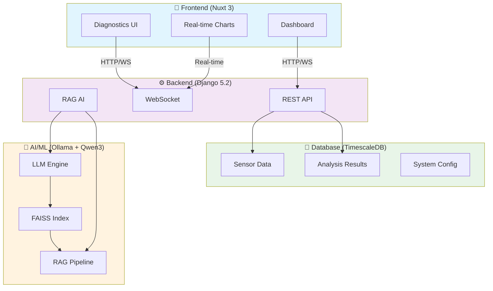
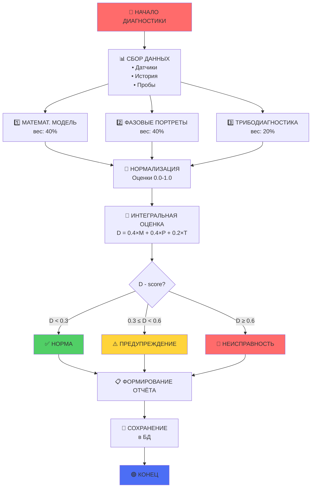
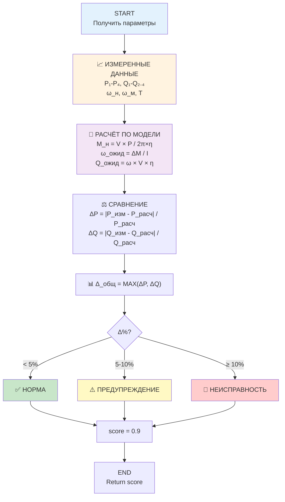
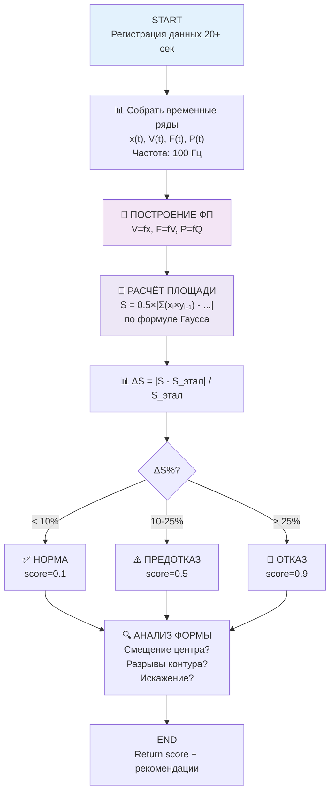
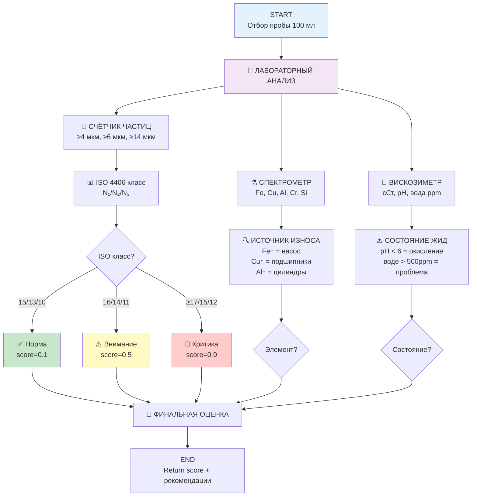
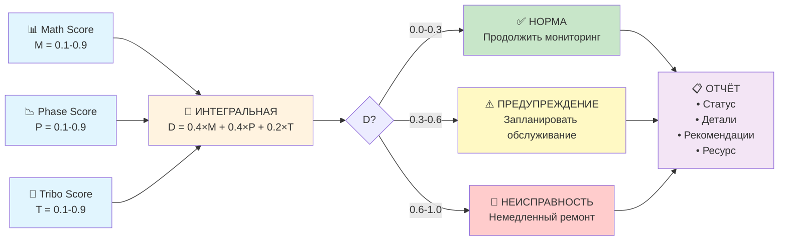

# 📚 Diagnostic System Guide v3.0 FINAL

## С Mermaid диаграммами, точками датчиков и реальными схемами

---

## 📖 Содержание

1. [Архитектура системы диагностики](#архитектура-системы)
2. [Точки подключения датчиков](#точки-подключения-датчиков)
3. [Красивые Mermaid диаграммы](#красивые-mermaid-диаграммы)
4. [Три метода диагностики](#три-метода-диагностики)
5. [Django Models](#django-models)
6. [API & Frontend](#api--frontend)
7. [Roadmap](#roadmap)

---

## 🏗️ Архитектура системы

### Общая архитектура



---

## 📍 Точки подключения датчиков

### Стенд Дубовика (с рекуперацией энергии)

```
┌─────────────────────────────────────────────────────────────┐
│                    ИСПЫТАТЕЛЬНЫЙ СТЕНД                       │
└─────────────────────────────────────────────────────────────┘

    [ЭЛЕКТРОДВИГАТЕЛЬ]
            ↓ ω_н (об/мин)
         📊 ДАТЧИК 1
            ↓
    [МУФТА МНОГОДИСКОВАЯ]
            ↓
    [ГИДРОНАСОС] ← ДАТЧИК P₁ (Мпа) [Давление сети]
         ↓
         ├─ ДАТЧИК Q₁ (л/мин) [Расход]
         └─ ДАТЧИК T₁ (°C) [Температура]
         ↓
    [ОБРАТНЫЙ КЛАПАН]
         ↓
    ┌────────────────────────────────────────┐
    │      ТОЧКА 2 (Давление после клапана)  │
    │  📊 ДАТЧИК P₂ (Мпа)                   │
    └────────────────────────────────────────┘
         ↓
         ├──────────────────┬──────────────────┐
         ↓                  ↓                  ↓
    ┌─────────┐       ┌─────────┐       ┌─────────┐
    │ ТОЧКА 3 │       │ ТОЧКА 4 │       │ ТОЧКА 7 │
    │ (P₃)    │       │ (P₄)    │       │ (Слив)  │
    │ 📊 ПОК  │       │ 📊 ПОК  │       │ 📊 ПОК  │
    └─────────┘       └─────────┘       └─────────┘
         ↓                  ↓                  ↓
    [ПРЕДОХР.         [ГИДРОМОТОР]       [БАК]
     КЛАПАН]               ↓
                       📊 ДАТЧИК 2
                       ω_м (об/мин)

    [ФИЛЬТР СЛИВА]
         ↓
    [ТЕПЛООБМЕННИК]
         ↓
    [АККУМУЛЯТОР (опционально)]
         ↓
    [ГИДРОБАК]
```

### Матрица датчиков (реальная конфигурация)

| Точка | Датчик ID     | Тип         | Единица | Диапазон     | Назначение                   |
| ----- | ------------- | ----------- | ------- | ------------ | ---------------------------- |
| **1** | P_pump        | Давление    | Мпа     | 0-250        | Давление на выходе насоса    |
| **1** | Q_pump        | Расход      | л/мин   | 0-50         | Расход насоса                |
| **1** | T_pump        | Температура | °C      | -10 до +80   | Температура жидкости         |
| **2** | P_after_valve | Давление    | Мпа     | 0-250        | После обратного клапана      |
| **3** | P_relief      | Давление    | Мпа     | 0-250        | На предохранительном клапане |
| **4** | P_motor_inlet | Давление    | Мпа     | 0-250        | На входе мотора              |
| **M** | ω_motor       | Скорость    | об/мин  | 0-3000       | Угловая скорость мотора      |
| **M** | F_motor       | Усилие      | Н       | 0-10000      | Усилие на валу мотора        |
| **5** | P_return      | Давление    | Мпа     | 0-10         | Давление в сливе             |
| **6** | x_position    | Положение   | мм      | 0-100        | Положение штока цилиндра     |
| **6** | V_piston      | Скорость    | мм/с    | -500 до +500 | Скорость поршня              |
| **7** | Vibr_accel    | Вибрация    | g       | 0-10         | Ускорение (вибрация)         |

---

## 🎨 Красивые Mermaid диаграммы

### 1. Диагностический цикл (главный процесс)



### 2. Математическая модель (алгоритм)



### 3. Фазовые портреты (анализ)



### 4. Трибодиагностика (анализ жидкости)



### 5. Интегральная оценка (финал)



---

## 🔧 Три метода диагностики

### Метод 1️⃣: Математическое моделирование

**Формулы:**

\(
M_н = \frac{V_0 \times P}{2\pi \times \eta}
\)

\(
\omega = \frac{M*д + M*м \times n - M*н}{I*д + I*н + I*{мех}}
\)

\(
Q = \omega \times V_0 \times \eta
\)

**Диагностика:**

- Δ < 5% → ✅ Норма
- 5% ≤ Δ < 10% → ⚠️ Внимание
- Δ ≥ 10% → 🔴 Неисправность

---

### Метод 2️⃣: Фазовые портреты

**Формула Гаусса (площадь):**

\(
S = 0.5 \times \left| \sum*{i=1}^{n-1} x_i y*{i+1} + x*n y_1 - \sum*{i=1}^{n-1} x\_{i+1} y_i - x_1 y_n \right|
\)

**Анализ:**
| ΔS | Статус | Действие |
|----|--------|----------|
| < 10% | ✅ Норма | Продолжить |
| 10-25% | ⚠️ Предотказ | Обслуживание |
| > 25% | 🔴 Отказ | Ремонт |

---

### Метод 3️⃣: Трибодиагностика

**Параметры:**

- ISO 4406 класс чистоты
- Элементный состав (Fe, Cu, Al, Cr)
- Физико-химические свойства (pH, вязкость, вода)

**Норма ISO 15/13/10**

---

## 💻 Django Models

### Core Models

```python
# backend/apps/diagnostics/models/core.py

class HydraulicSystem(models.Model):
    """Гидравлическая система"""
    name = models.CharField(max_length=200)
    system_type = models.CharField(max_length=20)
    max_pressure = models.FloatField()  # МПа
    nominal_flow = models.FloatField()  # л/мин
    created_at = models.DateTimeField(auto_now_add=True)
    is_active = models.BooleanField(default=True)

    class Meta:
        db_table = 'hydraulic_systems'

class Equipment(models.Model):
    """Оборудование"""
    system = models.ForeignKey(HydraulicSystem, on_delete=models.CASCADE)
    name = models.CharField(max_length=200)
    equipment_type = models.CharField(max_length=20)  # pump, motor, valve...
    technical_parameters = models.JSONField(default=dict)
    installation_date = models.DateTimeField()

    class Meta:
        db_table = 'equipments'

class Sensor(models.Model):
    """Датчик"""
    equipment = models.ForeignKey(Equipment, on_delete=models.CASCADE)
    name = models.CharField(max_length=200)
    sensor_type = models.CharField(max_length=20)  # pressure, flow, temp...
    unit = models.CharField(max_length=20)  # MPa, l/min, °C...
    min_value = models.FloatField()
    max_value = models.FloatField()
    is_active = models.BooleanField(default=True)

    class Meta:
        db_table = 'sensors'
```

### Diagnostic Results

```python
class MathematicalModelResult(models.Model):
    """Результат математической модели"""
    system = models.ForeignKey(HydraulicSystem, on_delete=models.CASCADE)
    timestamp = models.DateTimeField()

    status = models.CharField(max_length=20)  # normal, warning, fault
    deviation = models.FloatField()  # Δ%
    score = models.FloatField()  # 0.0-1.0

    class Meta:
        db_table = 'math_model_results'
        ordering = ['-timestamp']

class PhasePortraitResult(models.Model):
    """Результат фазовых портретов"""
    system = models.ForeignKey(HydraulicSystem, on_delete=models.CASCADE)
    timestamp = models.DateTimeField()

    area = models.FloatField()
    area_deviation = models.FloatField()  # ΔS%
    status = models.CharField(max_length=20)
    score = models.FloatField()  # 0.0-1.0

    class Meta:
        db_table = 'phase_portrait_results'

class IntegratedDiagnosticResult(models.Model):
    """Интегральный результат"""
    system = models.ForeignKey(HydraulicSystem, on_delete=models.CASCADE)
    timestamp = models.DateTimeField()

    math_score = models.FloatField()
    phase_score = models.FloatField()
    tribo_score = models.FloatField()

    integrated_score = models.FloatField()  # D
    overall_status = models.CharField(max_length=20)

    recommendations = models.TextField()
    predicted_remaining_life = models.IntegerField()  # часов

    class Meta:
        db_table = 'integrated_results'
        ordering = ['-timestamp']
```

---

## 🎨 API & Frontend

### API Endpoints

```
POST   /api/diagnostics/mathematical-model/
       Input: {system_id}
       Output: {status, deviation, score, recommendations}

POST   /api/diagnostics/phase-portraits/
       Input: {system_id}
       Output: {area, deviation, status, score}

POST   /api/diagnostics/tribodiagnostics/
       Input: {sample_id}
       Output: {iso_class, elements, status, score}

POST   /api/diagnostics/integrated/
       Input: {system_id}
       Output: {integrated_score, overall_status, recommendations}
```

### Frontend Pages

```
pages/
├── diagnostics/
│   ├── index.vue                    # Главная
│   ├── mathematical-model.vue       # Мат модель
│   ├── phase-portraits.vue          # ФП
│   ├── tribodiagnostics.vue         # Трибо
│   └── integrated.vue               # Интегральный анализ
├── systems/[systemId]/
│   └── index.vue                    # Обзор системы
└── reports.vue                      # Отчёты
```

---

## 🚀 Roadmap

### Sprint 1: Models (1 неделя)

- [ ] Django models
- [ ] Миграции
- [ ] DRF serializers

### Sprint 2: API (1 неделя)

- [ ] Endpoints всех методов
- [ ] Calculations functions
- [ ] WebSocket для real-time

### Sprint 3: Frontend (2 недели)

- [ ] Pages создание
- [ ] VEchart интеграция
- [ ] Forms

### Sprint 4: Testing (1 неделя)

- [ ] Unit tests
- [ ] Integration tests
- [ ] E2E тесты

---

**Версия:** v3.0 FINAL ✅  
**Статус:** Готово к разработке  
**Сложность:** ⭐⭐⭐⭐ (средняя-высокая)

**Источники:**

- Дубовик Е.А. "Стенд для испытания объемных гидромашин с рекуперацией энергии"
- Гареев А.М. "Использование фазовых портретов для диагностирования гидравлических систем"
- Галдин Н.С., Семенова И.А. "Гидравлические схемы мобильных машин"
- ГОСТ 2.704-76 "Правила выполнения гидравлических схем"
